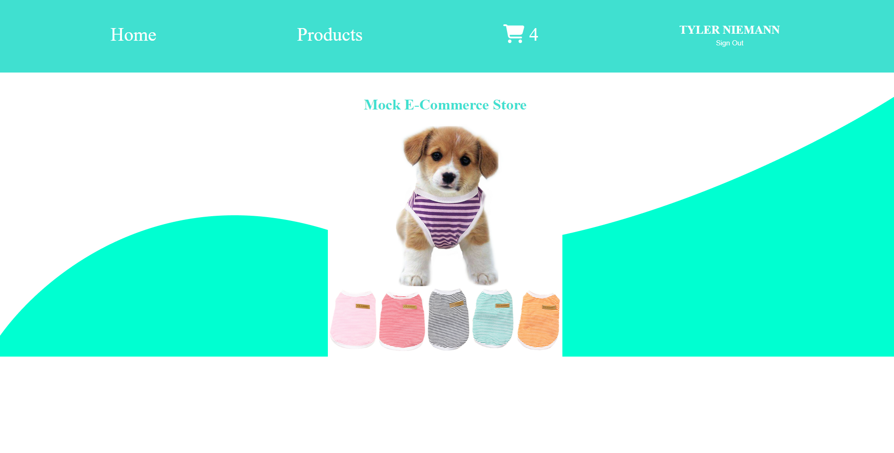
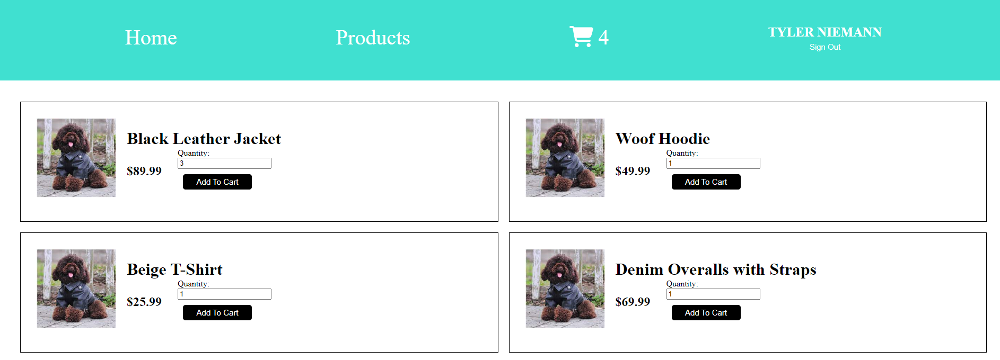
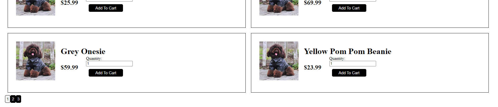
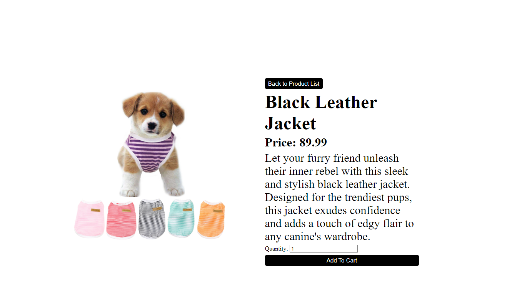
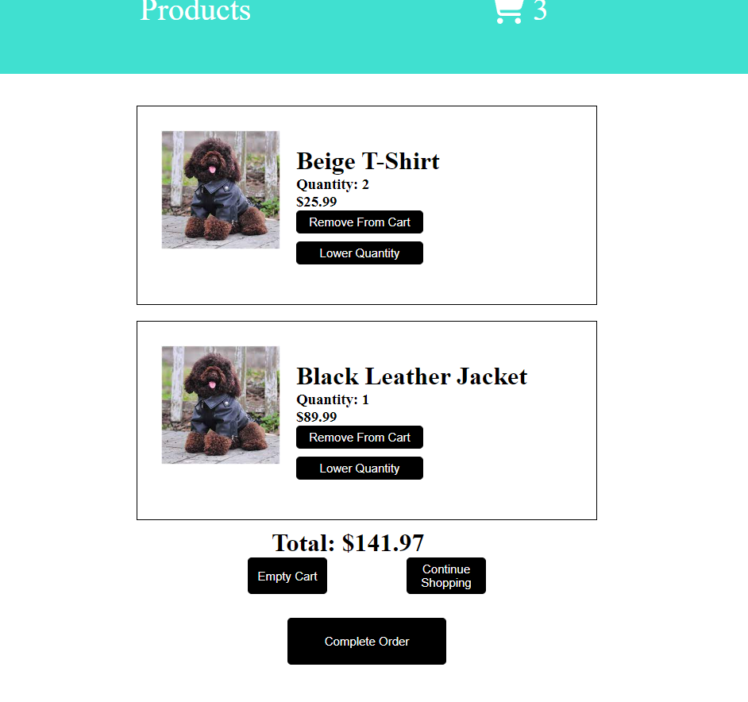
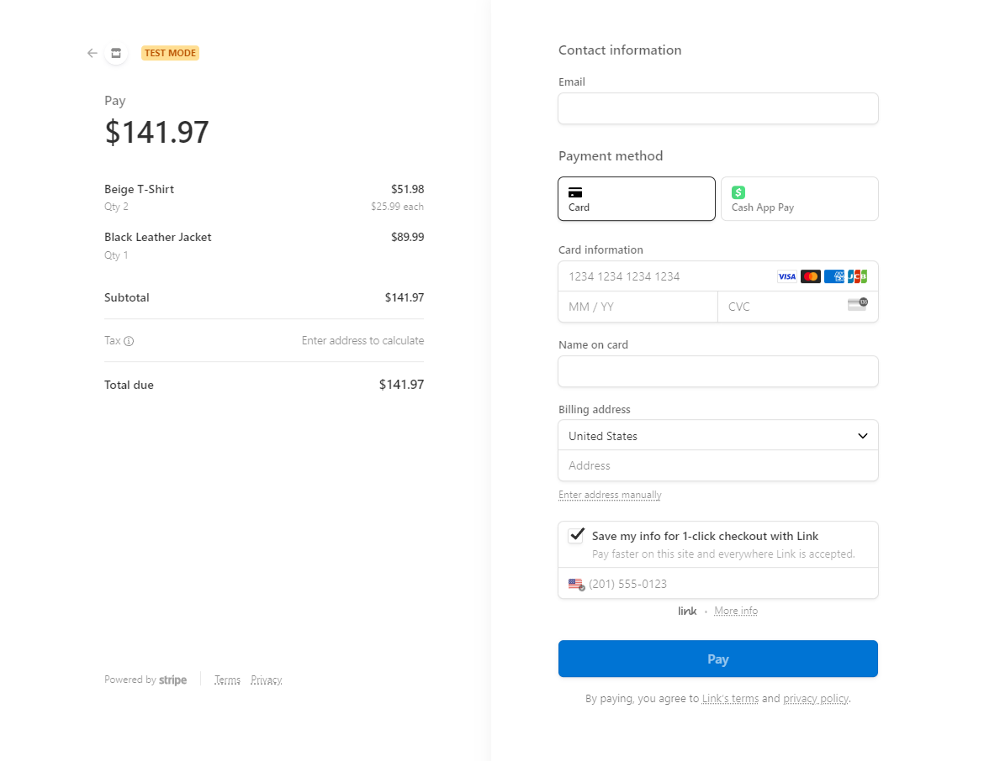
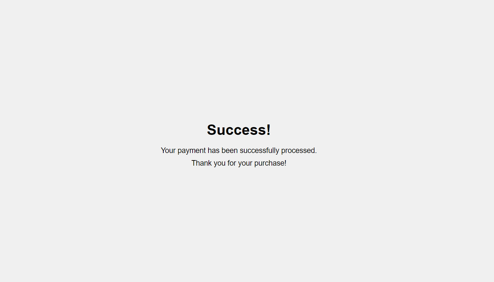

Check it out at https://web-store-6ff8b.web.app/

## Dog Clothing Store

Welcome to the E-commerce Dog Clothing Platform! This platform is designed to provide a seamless shopping experience for users, 

with user authentication, a fully functional shopping cart, and secure payment processing using Stripe. 

The project is built using React, Node.js, Firestore, and hosted on Firebase.

## Features

User authentication: Users can create accounts, log in, and securely authenticate their identity.

Shopping cart functionality: Users can browse products, add items to their cart, adjust quantities, and remove items.

Payment processing: Users can securely complete their purchase using Stripe for payment processing.

Firestore integration: The platform uses Firestore as the database to store product information, user data, and cart details.

Responsive UI: The platform is designed to provide a seamless experience on both desktop and mobile devices.

## Screenshots

## Getting Started

To access the E-commerce Platform, simply visit the following domain: https://web-store-6ff8b.web.app/

Please note that the platform is fully hosted on Firebase, so there is no need for installation or setup. Users can directly access the website and start exploring the features.

## Technologies Used

Front-end:

React: JavaScript library for building user interfaces.

Stripe: Payment processing API for secure and seamless transactions.

Back-end:

Node.js: JavaScript runtime for server-side development.

Firestore: NoSQL document database for storing product information, user data, and cart details.

Stripe: Server-side integration for handling payment requests and ensuring secure transactions.

Hosting:

Firebase Hosting: Hosting platform for deploying and serving the front-end and back-end of the application.

## Contributing

Contributions to the E-commerce Platform are welcome! If you find any issues or have suggestions for improvements, 

please feel free to open an issue or submit a pull request. Your contributions can help enhance the functionality

and user experience of the platform.

## Contact

If you have any questions or need further assistance, please feel free to contact me at tntman98@gmail.com.

  
